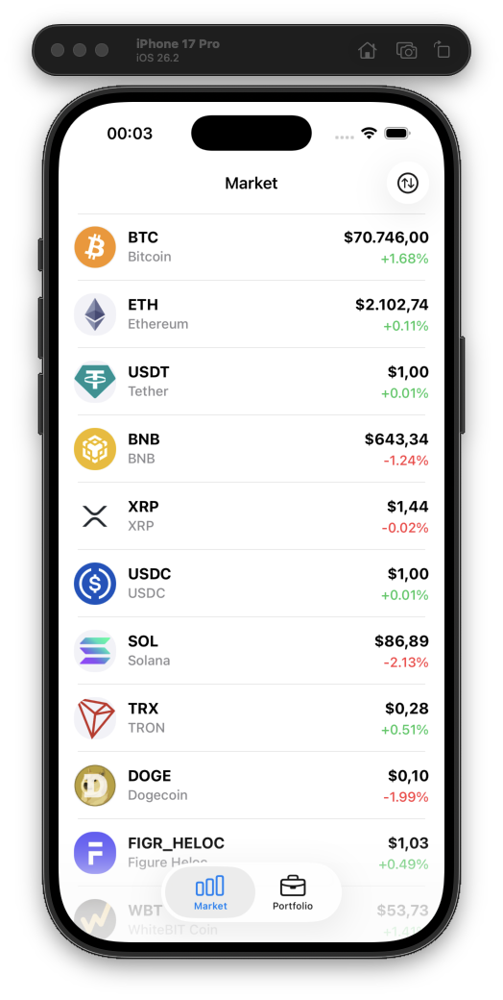
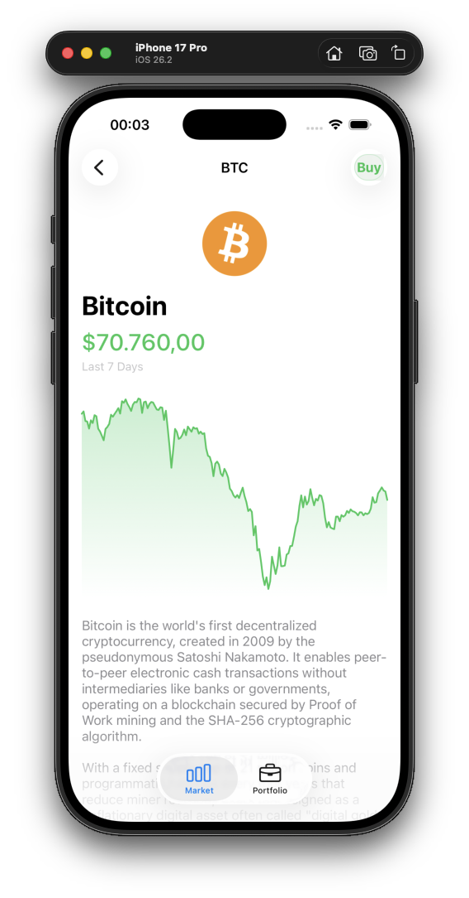
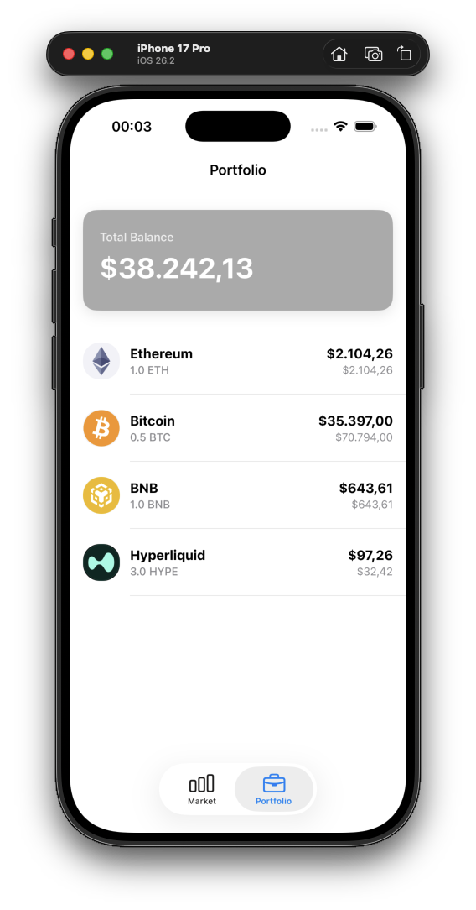

# 🚀 FinTech - Advanced Crypto Market & Portfolio App

[](https://swift.org)
[](https://developer.apple.com/ios/)
[](https://en.wikipedia.org/wiki/Model%E2%80%93view%E2%80%93viewmodel)
[](https://developer.apple.com/documentation/combine)
[](https://fastlane.tools/)

**FinTech** is a scalable, testable, and high-performance cryptocurrency tracking and portfolio management application built using modern iOS development standards.

This project integrates advanced engineering practices such as **Clean Architecture**, **MVVM-C (Coordinator)**, **Reactive Programming (Combine)**, and **Programmatic UI**.

---

## 📱 Screenshots

| Market (Home) | Detail & Chart | Portfolio |
|:---:|:---:|:---:|
|  |  |  |

---

## 🌟 Key Features

* **Real-time Market Data:** Live crypto data integration via CoinGecko API.
* **Reactive UI:** Seamless data flow and state management using the `Combine` framework.
* **Portfolio Management:** Local simulation of buy/sell operations and balance tracking using `CoreData`.
* **Advanced Charts:** Interactive price history graphs using a custom-drawn `SparklineView`.
* **Smart Searching & Sorting:** Debounced search and multiple sorting algorithms powered by Combine.
* **Pull-to-Refresh:** Smart cache management for data refreshing.
* **Safety First:** Robust error handling and user-friendly alert mechanisms.

---

## 🛠 Tech Stack & Tools

Technologies in this project were selected based on industry standards and performance requirements.

| Category | Technology | Reason |
| :--- | :--- | :--- |
| **Language** | Swift 5.9 | Modern, safe, and fast. |
| **Architecture** | Clean Architecture + MVVM | Separation of Concerns (SoC) and testability. |
| **Navigation** | Coordinator Pattern | Decoupling navigation logic from ViewModels. |
| **UI** | UIKit (Programmatic) + SnapKit | Performant, dynamic interfaces without Storyboard dependencies. |
| **Reactive** | Combine | Declarative management of data streams and UI updates. |
| **Networking** | Alamofire | Reliable, testable, and generic networking layer. |
| **Local Storage** | CoreData | Secure and persistent storage for portfolio data. |
| **Image Loading** | Kingfisher | Asynchronous image loading and caching. |
| **Testing** | XCTest & XCUITest | Ensuring integrity of business logic and UI flows. |
| **CI/CD** | Fastlane | Automation of testing and build processes. |
| **Code Quality** | SwiftLint | Enforcing code standards and quality. |

---

## 🏗 Architecture Overview

The project is strictly structured around **Clean Architecture** principles, divided into 4 main layers:

1.  **Domain Layer (Business Logic):**
    * Defines "what" the app does. Completely independent of any frameworks (UIKit, Alamofire, etc.).
    * *Entities, UseCases, Repository Protocols.*
2.  **Data Layer (Data Access):**
    * Manages where data comes from (API or CoreData).
    * *Repositories, DTOs, Endpoints, NetworkManager, CoreDataManager.*
3.  **Presentation Layer (UI):**
    * Manages how data is displayed to the user.
    * *ViewModels, Views (Controllers), Coordinators.*
4.  **Infrastructure Layer:**
    * Core building blocks.
    * *Extensions, Constants, Utilities.*

### Dependency Injection
All dependencies (Repositories, UseCases, ViewModels) are injected externally using the `Builder` pattern. This ensures modules are **loosely coupled** and highly testable.

---

## 🧪 Testing & Quality Assurance

The development process was heavily influenced by **TDD (Test Driven Development)** principles.

### ✅ Unit Tests
Business logic (ViewModel and UseCase layers) is tested in isolation.
* **Mocking:** Repositories and Services are mocked to test without external dependencies.
* **Combine Testing:** Asynchronous data streams are tested using `Expectation` and `Cancellables`.

### 🤖 UI Tests (Automation)
Critical User Journeys are verified through automated UI tests.
* *Example: App Launch -> Load List -> Navigate to Detail Page.*

### 🛡️ Code Quality (Linting)
**SwiftLint** is integrated into the build phase. Code quality is scanned during every build, and non-standard patterns are automatically reported.

---

## 🚀 CI/CD & Automation (Fastlane)

**Fastlane** has been set up to eliminate manual processes.

With a single command, the system:
1.  Cleans the project.
2.  Builds the app.
3.  Runs all Unit and UI Tests in the simulator.
4.  Reports the results.

To run the automation:
```bash
bundle exec fastlane tests
```

## 📥 Installation & Setup

Follow the steps below to run the project on your local machine:

1. **Clone the Repository:**

 ```bash
 git clone [https://github.com/username/FinTech.git](https://github.com/username/FinTech.git)
 cd FinTech
```

2. **Install Tools (Optional - For Fastlane): If you plan to run tests via terminal, install Bundler.**
```bash
gem install bundler
bundle install --path vendor/bundle

```


3. **Open the Project: Since packages (Alamofire, SnapKit, etc.) are managed via Swift Package Manager (SPM), no pod install is required.**
```bash
open FinTech.xcodeproj

```

4. **Wait for Package Resolution: Xcode will automatically fetch and resolve SPM packages upon opening.**
5. **Run: Press Cmd + R to launch the app!**

---

## 🧠 Engineering Highlights (What makes this special?)

* **Memory Management:** Retain Cycles are meticulously prevented using ``[weak self]`` patterns and verified via the Memory Graph Debugger.
* **SOLID Principles:** All classes are designed adhering to Single Responsibility and Dependency Inversion principles.
* **Protocol Oriented Programming:** Communication is handled via abstractions (Interfaces) to maximize testability.
* **Strategy Pattern:** Visual states of assets (Bullish, Bearish, Neutral) are managed using the Strategy Design Pattern.
